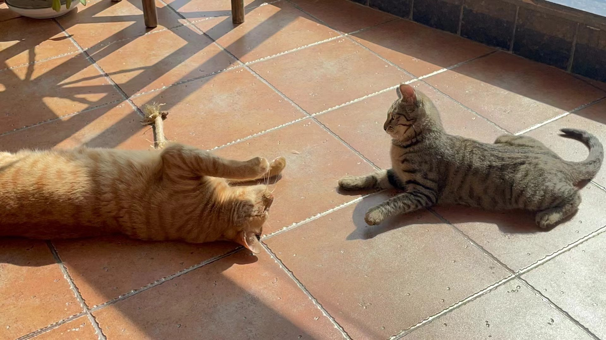








Welcome to my personal website!  I am Huichi Zhou (周辉池), an incoming MRes student at Imperial College London for the 2024-2025 academic year. 

=====

# 💡 Research Interest

- Adversarial Attack and Defense
- Natural Language Processing
  

# 🔥 News
- *2024.06.01*: &nbsp;🎉🎉 Our paper MLLM-AS-A-JUDGE has been selected ICML 2024 Oral! 
- *2024.05.17*: &nbsp;🎉🎉 One paper has been accepted by ACL 2024 Findings! 
- *2024.05.02*: &nbsp;🎉🎉 One paper has been accepted by ICML 2024! 

# 📝 Publications 

ACL 2024

**Evaluating the Validity of Word-level Adversarial Attacks with Large Language Models** [[PDF]](https://drive.google.com/file/d/1wq4iaSicSBiljMUt7lENMPOOLneZj4EO/view?usp=drive_link)  [[Github]](https://github.com/HuichiZhou/AVLLM)

**Huichi Zhou** \*, Zhaoyang Wang \*, Hongtao Wang , Dongping Chen, Wenhan Mu, Fangyuan Zhang

ICML 2024 Oral

**MLLM-as-a-Judge: Assessing Multimodal LLM-as-a-Judge with Vision-Language Benchmark** [[PDF]](https://arxiv.org/abs/2402.04788) [[Github]](https://github.com/Dongping-Chen/MLLM-Judge) [[Website]](https://mllm-judge.github.io/)

Dongping Chen \*, Ruoxi Chen \*, Shilin Zhang \*, Yinuo Liu \*, Yaochen Wang \*, **Huichi Zhou** \*, Qihui Zhang \*, Pan Zhou, Yao Wan, Lichao Sun

# 🗑️ Arxiv/Preprint Paper

Preprint

**Low-Resource Language Matter!** [[PDF]](https://drive.google.com/file/d/1ePTxb8N9eal22JBM1ZdeE-nPzLjKk5sk/view?usp=drive_link))

**Huichi Zhou**, Kaihong Li, Haoze Xu, Munan Zhao, Yue Huang, Zhaoyang Wang, Hongtao Wang

Preprint

**MPAT: Building Robust Deep Neural Networks against Textual Adversarial Attacks** [[PDF]](https://arxiv.org/abs/2402.18792) 

Fangyuan Zhang, **Huichi Zhou**, Shuangjiao Li, Hongtao Wang

Preprint

**A Key to Simpler Machine Unlearning in Large Language Models is Mixture of Experts** [[PDF]](https://drive.google.com/file/d/1Pi1gF8soTvc7hsXz2J1ptZEiJuSRNISx/view?usp=drive_link)

Chenrui Fan, **Huichi Zhou**, Zhengqing Yuan, Pan Zhou, Lichao Sun

Preprint

**Verifiable Format Control for Large Language Model Generations** [[PDF]](https://drive.google.com/file/d/1otw_wUNPw8d6TpHaTxsG9PD_EzDFNDb8/view?usp=drive_link)

Zhaoyang Wang \*, Jinqi Jiang \*, **Huichi Zhou** \*, Xuchao Zhang, Chetan Bansal, Huaxiu Yao

Preprint

**Can Large Language Models Improve the Adversarial Robustness of Graph Neural Networks?** [[PDF]](https://drive.google.com/file/d/1ZODpR5KWxyrY4suJXcfT5E9UhB8nU39f/view?usp=drive_link)

Zhongjian Zhang, Xiao Wang, **Huichi Zhou**, Yue Yu, Mengmei Zhang, Cheng Yang, Chuan Shi

Preprint

**TRev: A Timely Review Framework for Continual Learning** [[PDF]](https://drive.google.com/file/d/1_cFV66DJeLl731lAalVjiglKI6-nh_Io/view?usp=drive_link)

Haohao Ye, Hongtao Wang, **Huichi Zhou**, Yin Lv, Liran Yang

Preprint

**MDOE: Multi-Dimensional Compound Geometric Operations for Knowledge Graph Embedding** [[PDF]](https://drive.google.com/file/d/1MaHGXIFWvR9MsC-rm7HWSzheEVi8vDTk/view?usp=drive_link)

Heng Yu, Hongtao Wang, Zhongyu He, **Huichi Zhou**

Preprint

**GUI-World: A Dataset for GUI-oriented Multimodal LLM-based Agents** [[PDF]](https://arxiv.org/abs/2406.10819) [[Github]](https://github.com/Dongping-Chen/GUI-World) [[Website]](https://gui-world.github.io)

Dongping Chen \*, Yue Huang \*, Siyuan Wu \*, Jingyu Tang \*, Liuyi Chen, Yilin Bai, Zhigang He, Chenlong Wang, **Huichi Zhou**, Yiqiang Li, Tianshuo Zhou, Yue Yu, Chujie Gao, Qihui Zhang, Yi Gui, Zhen Li, Yao Wan, Pan Zhou, Jianfeng Gao, Lichao Sun

# 🎖 Honors and Awards
- *2023* National Scholarship (Top 1%)

# 💬 Invited Talks
- *2024.05.24* Invited Talk at Datawhale: Evaluating the Validity of Word-level Adversarial Attacks with Large Language Models. @[[Datawhale]](https://github.com/datawhalechina) 

# 📖 Educations
- *2020.09 - 2024.06 *, BEng.,  North China Electric Power University. 

<!-- # 💬 Invited Talks
- *2021.06*, Lorem ipsum dolor sit amet, consectetur adipiscing elit. Vivamus ornare aliquet ipsum, ac tempus justo dapibus sit amet. 
- *2021.03*, Lorem ipsum dolor sit amet, consectetur adipiscing elit. Vivamus ornare aliquet ipsum, ac tempus justo dapibus sit amet.  \| [\[video\]](https://github.com/) -->

<!-- # 💻 Internships
- *2023.09 - now*, [Lichao Sun](https://lichao-sun.github.io/), remote intern, Lehigh University. -->

# 🐱 My Beloved Cats and My Girl

    

        
        
    

    

        
    

